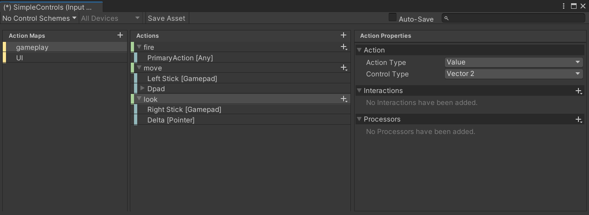
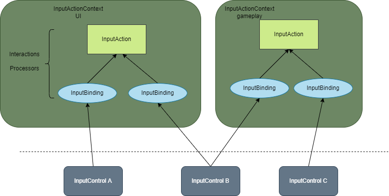
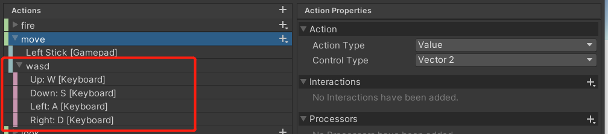
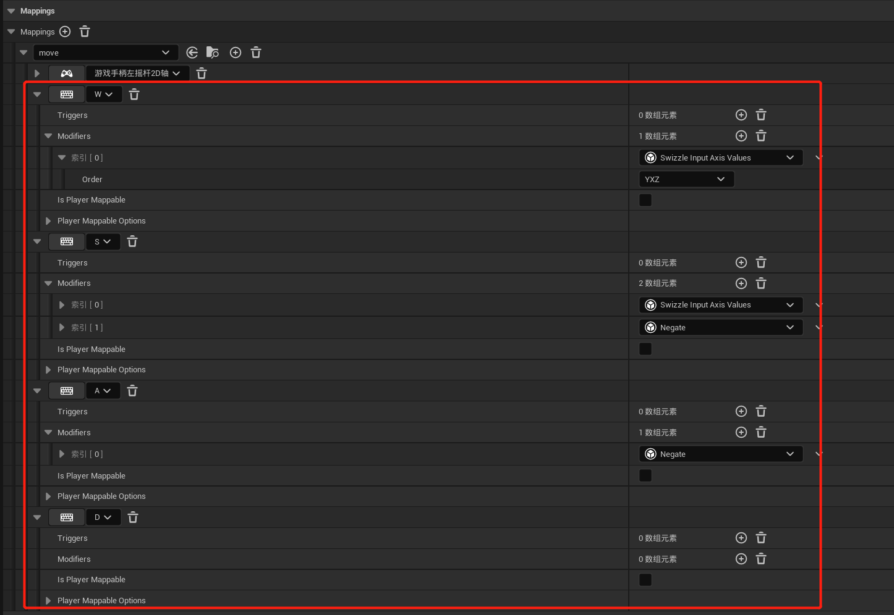
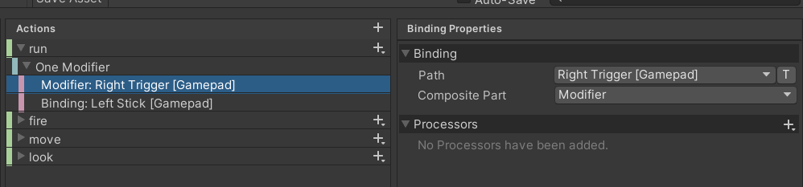
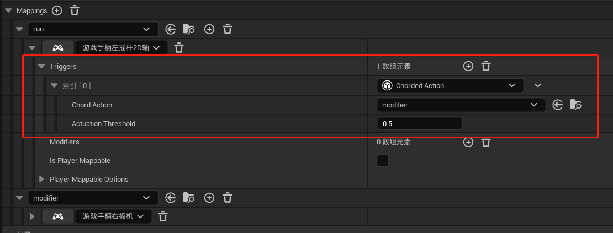
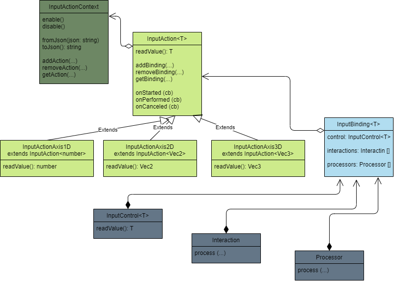
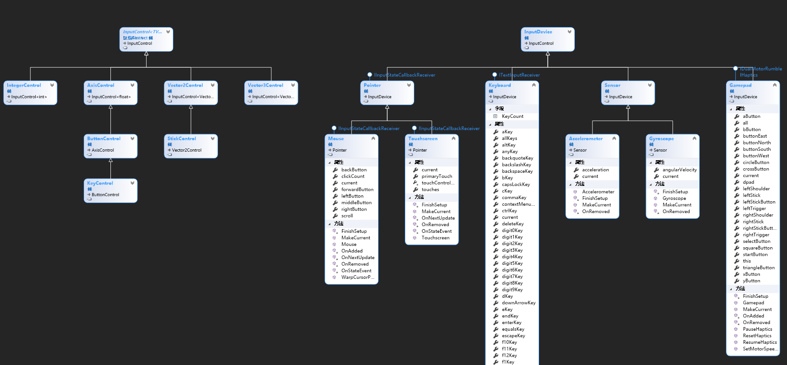

# 输入系统设计文档

## 输入系统的定位

未来 Cocos 会接入越来越多的输入设备，包括新增的手柄支持，也包括未来的 VR 设备。  
输入系统涵盖了从底层的输入信号的接入，到顶层的输入框架，提供了一套完整的游戏输入的解决方案，帮助开发者抹平输入设备的差异，让开发者更关注游戏与输入的交互逻辑，而不用花大的精力在处理输入设备的差异和细节上。

## 解决的问题

- 实现游戏输入的跨平台跨设备
- 实现运行时键位配置 和 配置数据的持久化
- 实现数据驱动输入绑定，将输入绑定的操作搬到编辑器上，而不是硬编码
- 提供一些通用的输入触发器，比如 长按，单击，双击/多次点击，持续按住 等
- ......

## 核心概念


图是 Unity InputAction 资源的配置截图

- InputActionContext 输入动作上下文（对应图中的 Action Maps 一栏），当多个动作尝试消耗同一个输入信号时，需要通过控制 InputActionContext 来解决输入冲突，比如 UI 界面按动摇杆时执行 UI 导航操作，gameplay 界面按动摇杆时操控人物移动 

- InputAction 输入动作（对应图中 Actions 一栏），表示玩家输入的意图，他不关心触发它的特定输入设备，但知道它的当前状态 

- InputBinding 输入绑定，将具体输入信号绑定到 InputAction 上，比如可以将键盘 wasd 和手柄摇杆绑定到 move action 上

- Interaction 在 Unreal 里边叫 Trigger，根据输入值以及输入动作来决定是否要触发 Action，比如跑步动作需要双击前进才能触发

- Processor 在 Unreal 里边叫 Modifier，可以将原始的输入信号处理之后送到 Interaction，比如将鼠标的屏幕坐标转换到世界坐标

- InputControl 查询具体输入设备的输入信号，可以是 number, Vec2, Vec3 等类型

### 基本的流程是这样的



- 图里的 InputAction InputBinding 这两个层级，都是可以配置 Interactions 和 Processors 属性的
- 其中 InputControl B 被两个 InputAction 绑定了，这时候就需要开发者根据游戏的场景，选择性的开启 InputActionContext 了，否则就会造成输入冲突

## Unity 和 Unreal 绑定方案对比

### 在多向输入绑定上，两个引擎的实现方式不一样

举个例子，如果 move action 是一个 Vec2 类型的动作，由于手柄摇杆天然就可以接收 Vec2 类型的输入信号，所以可以直接绑定，但是键盘就不行，键盘按键是离散的 bool 值，不能直接绑定到 Vec2 类型的 action 上。

- Unity 采用 Composite 的方式来实现组合绑定，将 wasd 绑定在一起，包装成一个 Composite Vec2 类型，再绑定到 move action 上



- Unreal 上，则通过 Swizzle Modifier 将 W S 输入信号切到 Y 轴上，再通过 Negate Modifier 将 A S 输入转到轴的负方向上，实现 Vec2 类型的绑定，看起来操作要比 Unity 繁琐很多



### 对修饰键的处理

修饰键包括但不限于 键盘的 ctrl alt shift cmd 键，很多时候手柄的扳机键也可以作为修饰键

- Unity 对修饰键的处理，是基于 Composite 的基础上，将其中一个 Binding 类型设置为 Modifier


- Unreal 对修饰键的处理，是基于 Trigger 的基础上，新增一个 Chorded Action 的 Trigger，可以将这个 Action 视为一个修饰键触发的动作，只有先触发 Chorded Action，才能触发当前的 run action


## 架构设计

整体架构如下：



其中 InputControl 相关的设计如下：



各个 InputDevice 下边大部分属性都是可绑定的 InputControl 对象

## 使用案例
```ts
let iac = new InputActionContext();
let iaRun = new InputActionAxis1D('run', [
    {
        control: Keyboard.keyA,
        interactions: [new InteractionMultiTap({tapCount: 2, maxTapTime: 1, timeSpacing: 0.5})],
    },
    {
        control: Gamepad.p1.leftStick.right,
        interactions: [new InteractionMultiTap({tapCount: 2, maxTapTime: 1, timeSpacing: 0.5})],
    },
]);
iac.addAction(iaRun);
let iaMove = new InputActionAxis2D('move', [
    {
        control: Gamepad.p1.leftStick,
    },
    {
        control: new CompositeControlAxis2D({
            up: Keyboard.keyW,
            down: Keyboard.keyS,
            left: Keyboard.keyA,
            right: Keyboard.keyD,
        }),
    }
]);
iac.addAction(iaMove);
iac.enable();

// 注册动作触发时的回调
iaRun.onPerformed(() => { console.log('on action run performed'); });
iaMove.onPerformed(() => { console.log('on action move performed'); });
```

## Q&A
1. 命名问题 ？

2. 对于没有跨平台需求的项目，有没有更简易的方案 ？

3. 如何与现有的输入事件系统兼容 ？

4. 如何接入 VR 设备 ？

5. 输入事件的必要性是什么 ？